# Jarkom-Modul-5-F06-2023
 
Kelompok F06:
- Arkana Bilal Imani / 5025211034
- 🤓

## Resource

- [Sheet Perhitungan](https://docs.google.com/spreadsheets/d/14c60BSwHFZ9jMbxMC8V4LwsBkQ76Yv2QWYykRAxKQ2Y/edit?usp=sharing)

## Daftar Isi

- [Daftar Isi](#daftar-isi)
- [Prerequisite](#prerequisite)
- [Pembagian Subnet](#pembagian-subnet)
- [VLSM Subnetting](#vlsm-subnetting)
- [VLSM Routing](#vlsm-routing)
- [DHCP](#dhcp)
- [DNS](#dns)
- [Nomor 1](#nomor-1)
- [Nomor 2](#nomor-2)
- [Nomor 3](#nomor-3)
- [Nomor 4](#nomor-4)
- [Nomor 5](#nomor-5)
- [Nomor 6](#nomor-6)
- [Nomor 7](#nomor-7)
- [Nomor 8](#nomor-8)
- [Nomor 9](#nomor-9)
- [Nomor 10](#nomor-10)

### Prerequisite

- Buat topologi sesuai berikut:
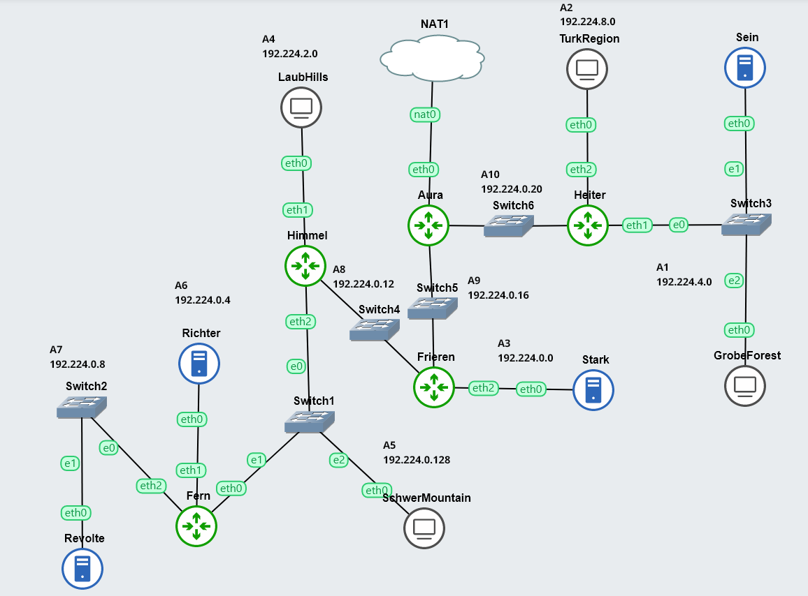
- Keterangan:	
  - Richter adalah DNS Server
  - Revolte adalah DHCP Server
  - Sein dan Stark adalah Web Server
  - Jumlah Host pada SchwerMountain adalah 64
  - Jumlah Host pada LaubHills adalah 255
  - Jumlah Host pada TurkRegion adalah 1022
  - Jumlah Host pada GrobeForest adalah 512

###  Pembagian Subnet
- [Daftar Isi](#daftar-isi)

Topologi soal dibagi menjadi berikut:
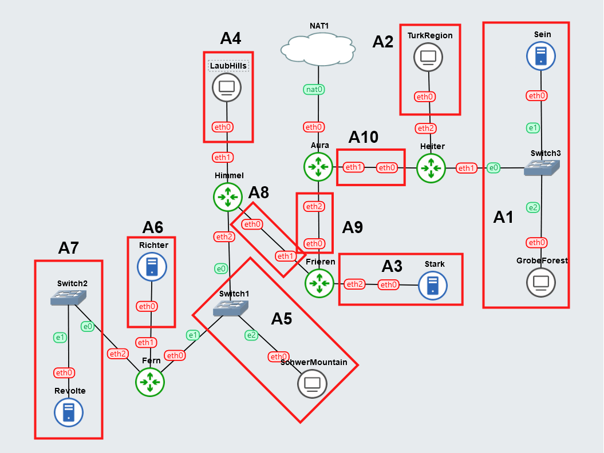

Dengan pembagian rute sebagai berikut:
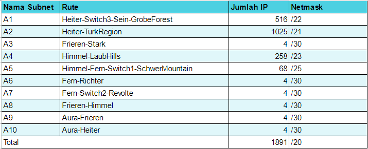

### VLSM Subnetting
- [Daftar Isi](#daftar-isi)

Rute dan subnet tersebut langsung dapat di-assign-kan IP dengan metode VLSM menggunakan tree sebagai berikut:

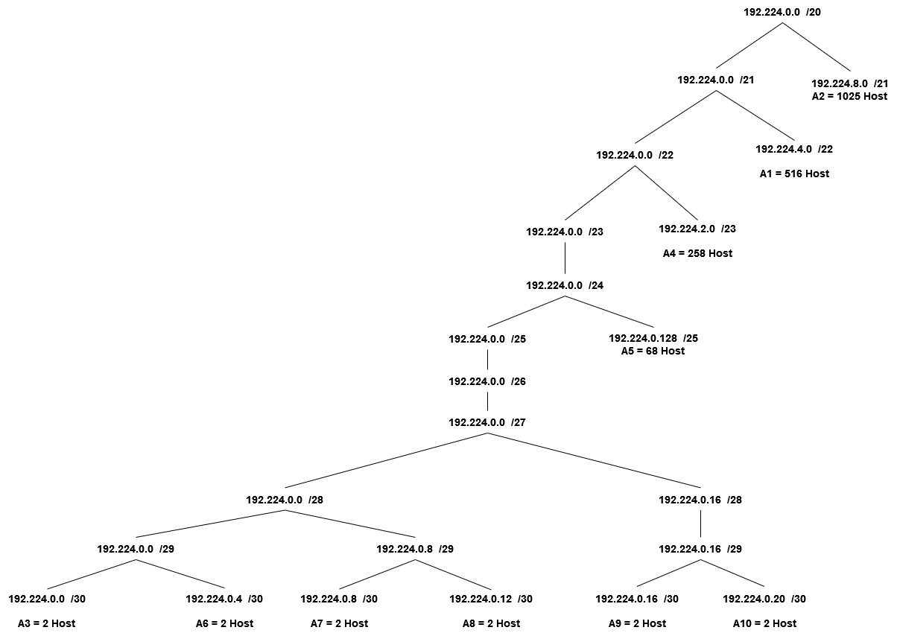

Lalu diberikan broadcast IP sebagai berikut:

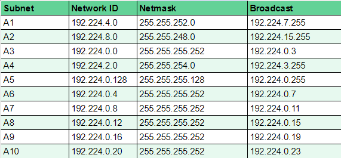

### VLSM Routing
- [Daftar Isi](#daftar-isi)

Dengan subnetting tersebut, langsung saja dilakukan routing pada setiap subnet di GNS3. Menggunakan command `iptables add -net (IP NID) netmask (Netmask IP) gw (Gateway IP)`.

Contoh semua command iptables di router Aura:
```bash
route add -net 192.224.4.0 netmask 255.255.252.0 gw 192.224.0.22 #A1
route add -net 192.224.8.0 netmask 255.255.248.0 gw 192.224.0.22 #A2

route add -net 192.224.0.0 netmask 255.255.255.252 gw 192.224.0.18 #A3

route add -net 192.224.2.0 netmask 255.255.254.0 gw 192.224.0.18 #A4
route add -net 192.224.0.12 netmask 255.255.255.252 gw 192.224.0.18 #A8
route add -net 192.224.0.128 netmask 255.255.255.128 gw 192.224.0.18 #A5
route add -net 192.224.0.4 netmask 255.255.255.252 gw 192.224.0.18 #A6
route add -net 192.224.0.8 netmask 255.255.255.252 gw 192.224.0.18 #A7
```

Tentu saja network config di setiap node juga dicocokkan, sesuai dengan routing yang sudah dilakukan.

Berikut adalah contoh network configuration Aura:
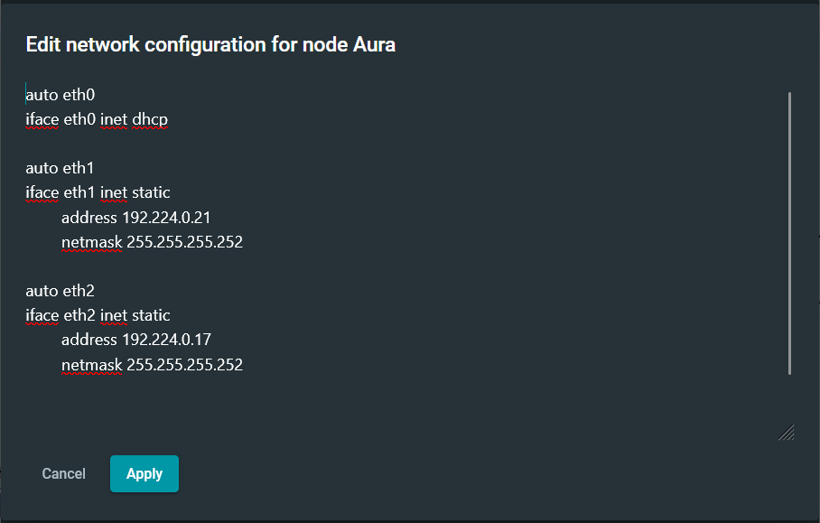

Pada Aura, eth0 terhubung ke NAT sehingga digunakan DHCP. Lalu eth1 terhubung dengan router Heiter pada subnet A10. Sesuai dengan routing, subnet A10 diberi NID `192.224.0.20` dan karena Aura mengarah ke pusat, maka IP eth1 pada Aura dibuat dengan NID + 1 = `192.224.0.21`. Begitu juga dengan eth2 yang terhubung dengan A9 yang memiliki NID `192.224.0.16` sehingga IP yang diberikan ke eth2 adalah NID + 1 = `192.224.0.17`.

### DHCP
- [Daftar Isi](#daftar-isi)

Server DHCP ditempatkan di Revolte. Setelah menjalankan instalasi server DHCP dengan command `apt-get install isc-dhcp-server -y`, jalankan skrip dibawah untuk melakukan konfigurasi DHCP.
```bash
echo '
subnet 192.224.0.8 netmask 255.255.255.252{
} #A7

subnet 192.224.0.4 netmask 255.255.255.252{
} #A6

subnet 192.224.0.12 netmask 255.255.255.252{
} #A8

subnet 192.224.0.16 netmask 255.255.255.252{
} #A9

subnet 192.224.0.20 netmask 255.255.255.252{
} #A10

subnet 192.224.0.0 netmask 255.255.255.252{
} #A3

subnet 192.224.8.0 netmask 255.255.248.0 {
    range 192.224.8.2 192.224.12.255;
    option routers 192.224.8.1;
    option broadcast-address 192.224.15.255;
    option domain-name-servers 192.224.0.6;
    default-lease-time 180;
    max-lease-time 5760;
} #A2

subnet 192.224.4.0 netmask 255.255.252.0 {
    range 192.224.4.3 192.224.6.255;
    option routers 192.224.4.1;
    option broadcast-address 192.224.7.255;
    option domain-name-servers 192.224.0.6;
    default-lease-time 180;
    max-lease-time 5760;
} #A1

subnet 192.224.0.128 netmask 255.255.255.128 {
    range 192.224.0.131 192.224.0.254;
    option routers 192.224.0.130;
    option broadcast-address 192.224.0.255;
    option domain-name-servers 192.224.0.6;
    default-lease-time 180;
    max-lease-time 5760;
} #A5

subnet 192.224.2.0 netmask 255.255.254.0 {
    range 192.224.2.2 192.224.3.254;
    option routers 192.224.2.1;
    option broadcast-address 192.224.3.255;
    option domain-name-servers 192.224.0.6;
    default-lease-time 780;
    max-lease-time 5760;
} #A4

' > /etc/dhcp/dhcpd.conf

echo '
INTERFACESv4="eth0"
' > /etc/default/isc-dhcp-server

service isc-dhcp-server restart
```

IP DNS server yang diberikan sesuai dengan topologi, yaitu Richter dengan IP `192.224.0.6`.

Perhitungan range pada setiap subnet menggunakan jumlah available IP yang didapat dari netmask setiap subnet.

Setelah server DHCP sudah berjalan, bisa diinstall dan dikonfigurasikan DHCP relay pada setiap router di topologi ini.

Contoh pada Fern, instalasi menggunakan command `apt-get install isc-dhcp-relay -y`, lalu konfigurasikan sesuai dengan skrip dibawah saat diprompt saat instalasi.

```conf
# Defaults for isc-dhcp-relay initscript
# sourced by /etc/init.d/isc-dhcp-relay
# installed at /etc/default/isc-dhcp-relay by the maintainer scripts

#
# This is a POSIX shell fragment
#

# What servers should the DHCP relay forward requests to?
SERVERS="192.224.0.10"

# On what interfaces should the DHCP relay (dhrelay) serve DHCP requests?
INTERFACES="eth0 eth1 eth2"

# Additional options that are passed to the DHCP relay daemon?
OPTIONS=""
```

Tentu saja server DHCP yang digunakan adalah Revolte dengan IP `192.224.0.10`. Lalu interfaces yang digunakan juga disesuaikan pada setiap router, dimana mayoritas router menggunakan eth0, eth1, dan eth2.

Apabila relay sudah berjalan, maka setiap client (SchwerMountains, LaubHills, TurkRegion, GrobeForest) seharusnya sudah bisa mendapatkan IP dari DHCP dengan contoh sebagai berikut:

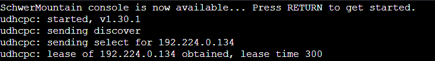

### DNS
- [Daftar Isi](#daftar-isi)

Server DNS ditempatkan di Richter. Setelah menjalankan instalasi DNS dengan command `apt-get install bind9 -y`, dapat dijalankan skrip dibawah ini untuk konfigurasi DNS.
```bash
mkdir /etc/bind/jarkom

echo '
options {
        directory "/var/cache/bind";

         forwarders {
                192.168.122.1;
         };

        //dnssec-validation auto;
        allow-query{any;};
        listen-on-v6 { any; };
};
' > /etc/bind/named.conf.options

service bind9 restart
```

Dibuatkan forwarder yang mengarah ke `192.168.122.1` supaya client dapat terhubung ke internet.

### Nomor 1
- [Daftar Isi](#daftar-isi)

**Agar topologi yang kalian buat dapat mengakses keluar, kalian diminta untuk mengkonfigurasi Aura menggunakan iptables, tetapi tidak ingin menggunakan MASQUERADE.**

Metode biasanya untuk mengakses internet dari NAT adalah menggunakan command `iptables -t nat -A POSTROUTING -o eth0 -j MASQUERADE -s 192.224.0.0/20` dimana semua paket yang mengarah keluar dari Aura didefinisikan sebagai berasal dari subnet `192.224.0.0` dengan netmask `/20`. MASQUERADE berguna dalam hal ini karena koneksi dari NAT ke Aura menggunakan IP dinamis, sehingga Aura tidak harus mengetahui IP yang diberikan dari NAT ke Aura terlebih dahulu untuk mendefinisikan setiap paket yang mengarah keluar.

Alternatif dari MASQUERADE adalah SNAT yang biasanya digunakan jika koneksi ke NAT menggunakan IP statis. Karena koneksi NAT ke Aura menggunakan IP Dinamis / DHCP, maka diperlukan untuk mengambil IP yang diberi oleh NAT ke Aura menggunakan command berikut:
```bash
eth0=$(ip -4 addr show eth0 | grep -oP '(?<=inet\s)\d+(\.\d+){3}')
```

Command tersebut mengambil IP pada interface eth0 pada Aura yang terhubung dengan NAT, lalu difilter menggunakan grep untuk diambil bagian IP-nya saja. Setelah didapatkan, nilai IP disimpan dalam variabel eth0 itu dan dimasukkan ke command iptables berikut:
```bash
iptables -t nat -A POSTROUTING -o eth0 -j SNAT --to-source $eth0
```

Menggunakan IP eth0 yang didapatkan tadi, semua paket yang keluar dari eth0 di Aura akan diberi tujuan / `--to-source` yang sama agar dapat tersalurkan ke NAT.

Pengetesan dilakukan di Aura dan di Richter sebagai berikut:
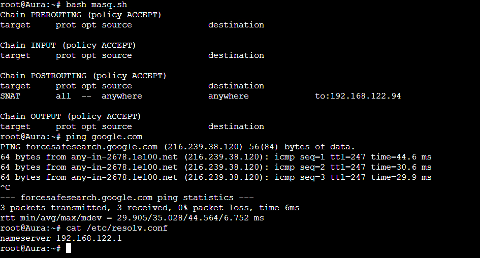
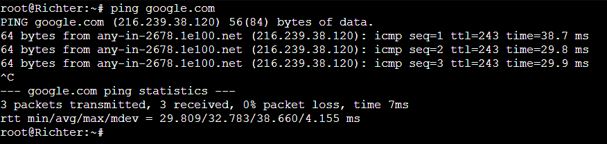

### Nomor 2
- [Daftar Isi](#daftar-isi)

**Kalian diminta untuk melakukan drop semua TCP dan UDP kecuali port 8080 pada TCP.**

Dapat menggunakan beberapa command berikut:
```bash
# Set default policies to DROP
iptables -P INPUT DROP
iptables -P FORWARD DROP
iptables -P OUTPUT DROP

# Allow incoming traffic on port 8080 TCP
iptables -A INPUT -p tcp --dport 8080 -j ACCEPT
```

Tiga command pertama membuat default policy dari chain INPUT, FORWARD, dan OUTPUT supaya drop semua paket. 

Lalu dengan menambahkan rule terakhir, dimana menggunakan `-A INPUT` untuk melakukan append atau penambahan pada chain INPUT. 

Kriteria lain yang digunakan adalah hanya bekerja pada protokol TCP (`-p tcp`) dan port 8080 (`--dport 8080`) untuk menerima paket atau melakukan ACCEPT (`-j ACCEPT`).

Berikut adalah hasil testing menggunakan command `nc -l -p 8080` di node Aura dan `nc 192.224.0.17 8080` di node lain.

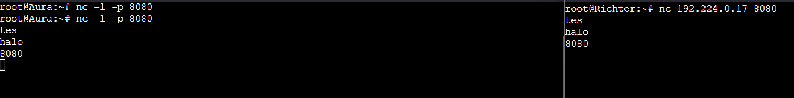

Untuk mengetes apakah port lain tidak bisa, tinggal diganti port saat melakukan netcat.

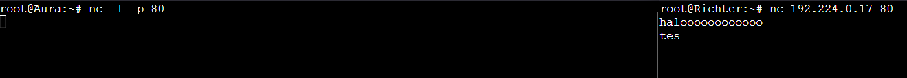

### Nomor 3
- [Daftar Isi](#daftar-isi)

**Kepala Suku North Area meminta kalian untuk membatasi DHCP dan DNS Server hanya dapat dilakukan ping oleh maksimal 3 device secara bersamaan, selebihnya akan di drop.**

Dapat menggunakan 2 command dibawah ini:
```bash
iptables -A INPUT -p icmp -m connlimit --connlimit-above 3 --connlimit-mask 0 -j DROP
iptables -I INPUT -m state --state ESTABLISHED,RELATED -j ACCEPT
```

Command pertama menggunakan matches / `-m` `connlimit` untuk membatasi jumlah koneksi yang menggunakan protokol ICMP (`-p icmp`) menjadi tidak lebih dari 3 koneksi (`--connlimit-above 3`). Ada juga `--connlimit-mask` yang diisikan dengan 0 supaya semua paket yang masuk difilter melalui rule ini.

Command kedua menggunakan matches / `-m` `state` untuk melihat apakah koneksi yang dilihat adalah koneksi yang sudah memiliki status / `--state` `ESTABLISHED, RELATED` atau tidak. Jika iya, maka koneksi tetap akan dilanjutkan.

Koneksi yang digunakan ping menggunakan protokol ICMP, jadi sudah sesuai dengan rule pertama, dan juga menggunakan status `ESTABLISHED, RELATED` juga sehingga akan dibolehkan rule kedua.

Berikut hasil tes di 4 client dan Richter.
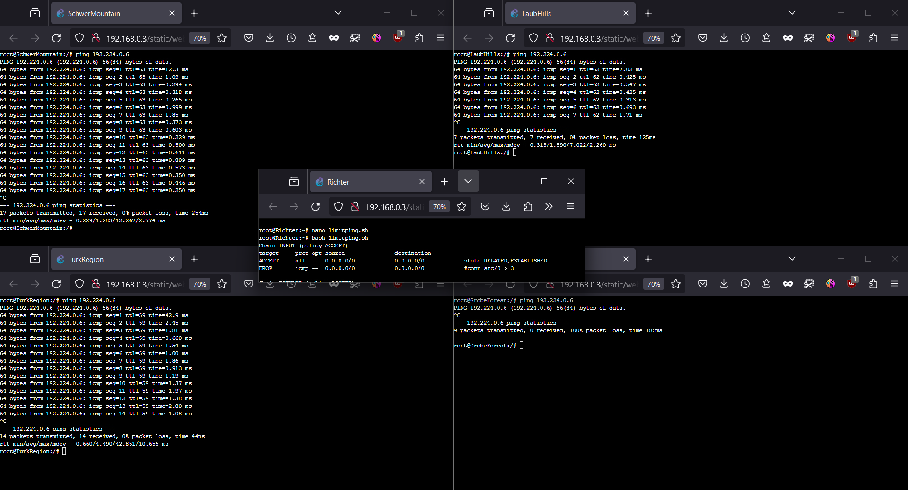

### Nomor 4
- [Daftar Isi](#daftar-isi)

**Lakukan pembatasan sehingga koneksi SSH pada Web Server hanya dapat dilakukan oleh masyarakat yang berada pada GrobeForest.**

Dapat menggunakan 2 command berikut ini:
```bash
iptables -A INPUT -p tcp --dport 22 -s 192.224.4.0/22 -j ACCEPT
iptables -A INPUT -p tcp --dport 22 -j DROP
```

Karena koneksi SSH menggunakan TCP pada transport layernya, maka penggunaan rule iptables tersebut bisa menggunakan `-p tcp` untuk menarget koneksi protokol  TCP. 

GrobeForest memiliki NID `192.224.4.0` dengan netmask `/22`. Maka dari itu bisa langsung dimasukkan ke rule dengan flag `-s` dan flag jump / `-j` `ACCEPT`.

Koneksi lain yang tidak cocok dengan rule pertama tersebut akan di drop dengan rule kedua.

Berikut adalah hasil testing di GrobeForest, LaubHills, dan Stark:

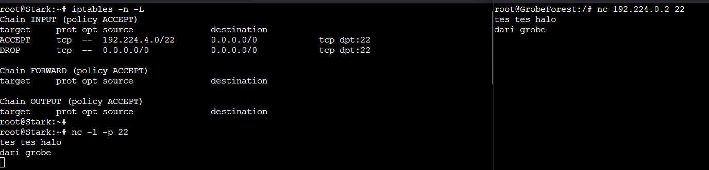
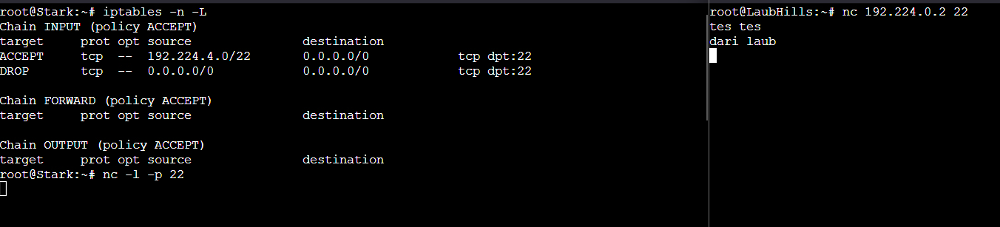

### Nomor 5
- [Daftar Isi](#daftar-isi)

**Selain itu, akses menuju WebServer hanya diperbolehkan saat jam kerja yaitu Senin-Jumat pada pukul 08.00-16.00.**

Dapat menggunakan command berikut:
```bash
iptables -A INPUT -m time --timestart 08:00 --timestop 16:00 --weekdays Mon,Tue,Wed,Thu,Fri -j ACCEPT
iptables -A INPUT -j REJECT
```

Seperti biasa, paket yang di `ACCEPT` adalah paket yang sesuai dengan kriteria di rule pertama.

Menggunakan matches `time` yang memiliki beberapa argumen yang sesuai dengan kebutuhan soal.
- `--timestart 08:00`: Menandakan pada jam berapa rule mulai menandakan paket, yaitu jam 8 pagi.
- `--timestop 16:00`: Menandakan pada jam berapa rule tidak menandakan paket lagi, yaitu jam 4 sore.
- `--weekdays Mon,Tue,Wed,Thu,Fri`: menandakan pada hari apa saja rule menandakan paket, yaitu pada hari Senin sampai Kamis.

Dites menggunakan command date `date --set="2023-12-16 20:00:00"` yang bisa dijalankan di client atau web server.

Berikut adalah hasil tes:
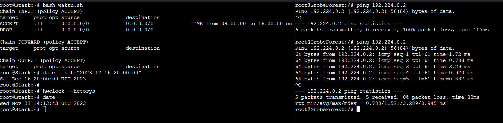

### Nomor 6
- [Daftar Isi](#daftar-isi)

**Lalu, karena ternyata terdapat beberapa waktu di mana network administrator dari WebServer tidak bisa stand by, sehingga perlu ditambahkan rule bahwa akses pada hari Senin - Kamis pada jam 12.00 - 13.00 dilarang (istirahat maksi cuy) dan akses di hari Jumat pada jam 11.00 - 13.00 juga dilarang (maklum, Jumatan rek).**

Bisa menggunakan 2 rule berikut:
```bash
iptables -A INPUT -m time --timestart 12:00 --timestop 13:00 --weekdays Mon,Tue,Wed,Thu -j DROP
iptables -A INPUT -m time --timestart 11:00 --timestop 13:00 --weekdays Fri -j DROP
```

Sama seperti nomor sebelumnya, dengan perbedaan di operasi yang dilakukan pada hari Senin sampai Kamis (`--weekdays Mon,Tue,Wed,Thu`)pada jam 12 (`--timestart 12:00`) sampai jam 1 (`--timestop 13:00`) dan pada hari jumat (`--weekdays Fri`) pada hari jam 11 (`--timestart 11:00`) sampai jam 1 (`--timestop 13:00`) yang merupakan operasi DROP, bukan ACCEPT. Dua rule tersebut perlu ditempatkan di atas rule nomor sebelumnya karena sifat rules pada iptables yang memiliki urutan dilakukannya proses filter dengan cara topdown.

Berikut adalah hasil testingnya:
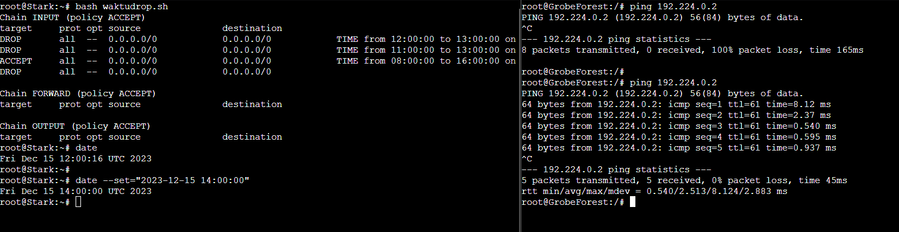

### Nomor 7
- [Daftar Isi](#daftar-isi)

**Karena terdapat 2 WebServer, kalian diminta agar setiap client yang mengakses Sein dengan Port 80 akan didistribusikan secara bergantian pada Sein dan Stark secara berurutan dan request dari client yang mengakses Stark dengan port 443 akan didistribusikan secara bergantian pada Sein dan Stark secara berurutan.**